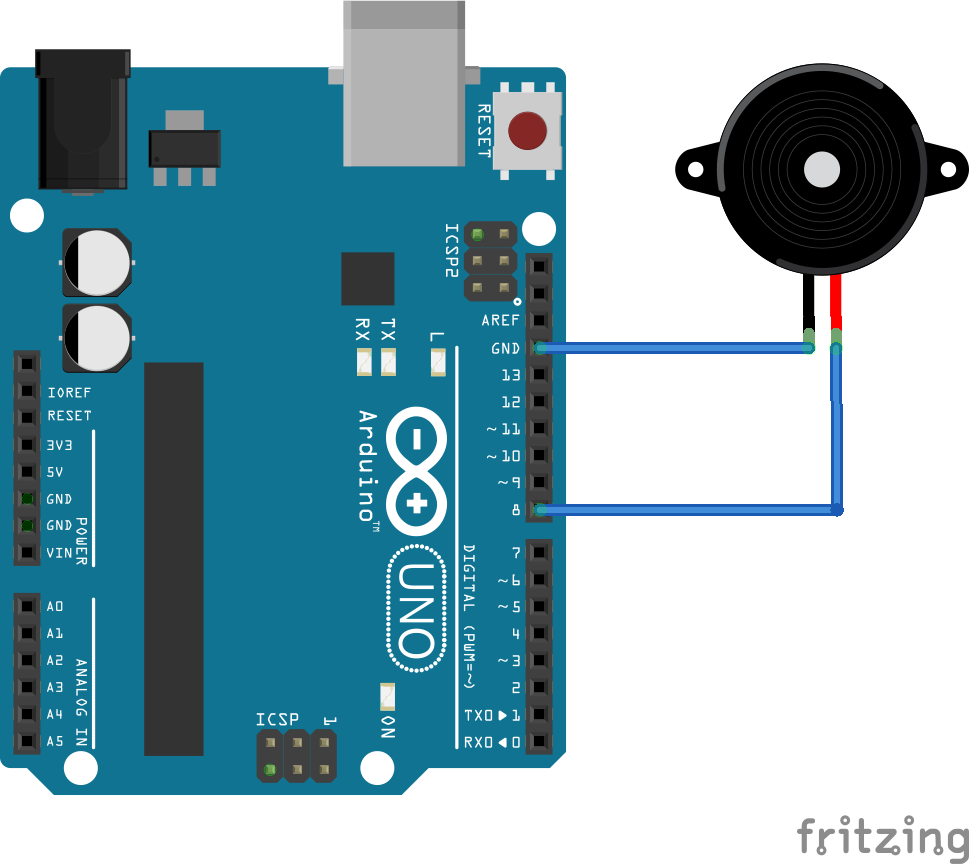

# Play Saregama melody with Passive Buzzer using Arduino Uno

## Components Required
- Arduino Uno R3(any Arduino Board)
- Arduino IDE
- Passive Buzzer
- Jumper wires
- Bread board

## Hardware schematic

## Compile and Upload the code

- Connect the Arduino USB to PC and click the upload button to upload the code to the Board.

That's it! You have successfully run the code to play Sa re ga ma melody with Passive Buzzer using Arduino Uno R3
